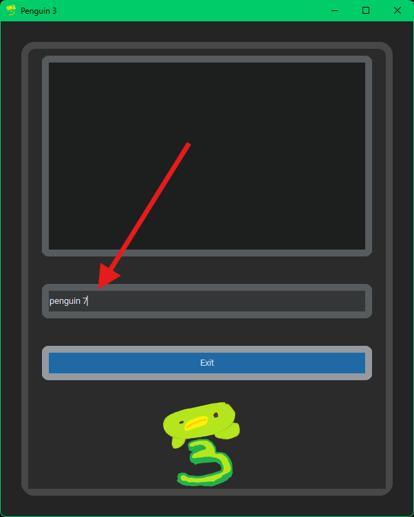
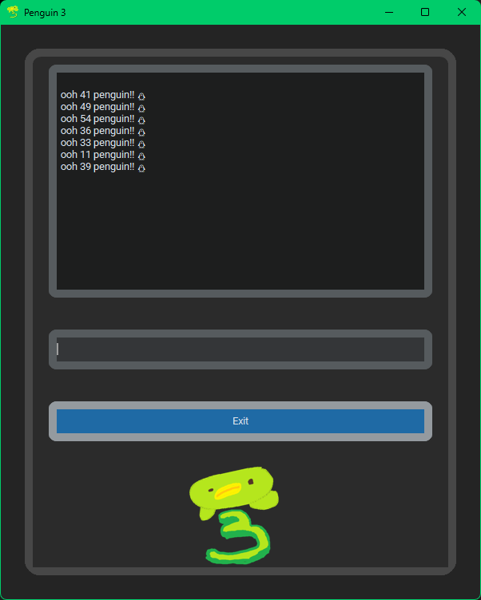

# Sub-keywords

You can use sub-keywords for keywords that need it, like `help` and `penguin`.  
First, check what they are about.

It says to put a number after `penguin`.  
We should try that out.

  
Cool!  

And that's how you use sub-keywords.