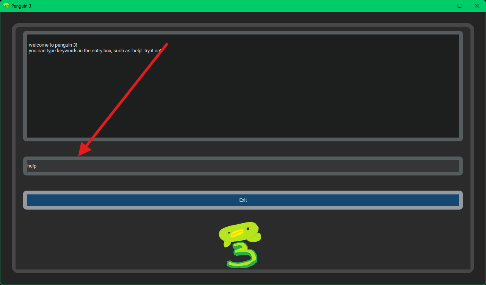
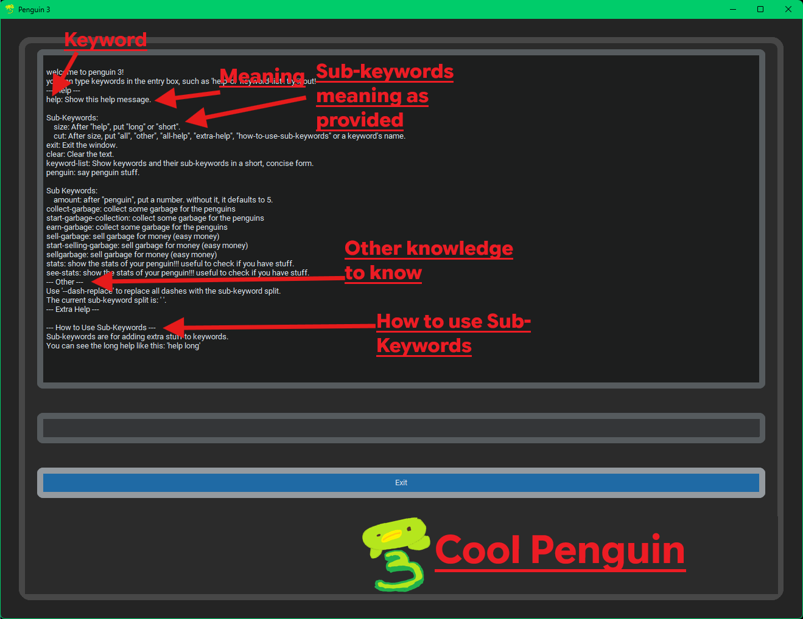
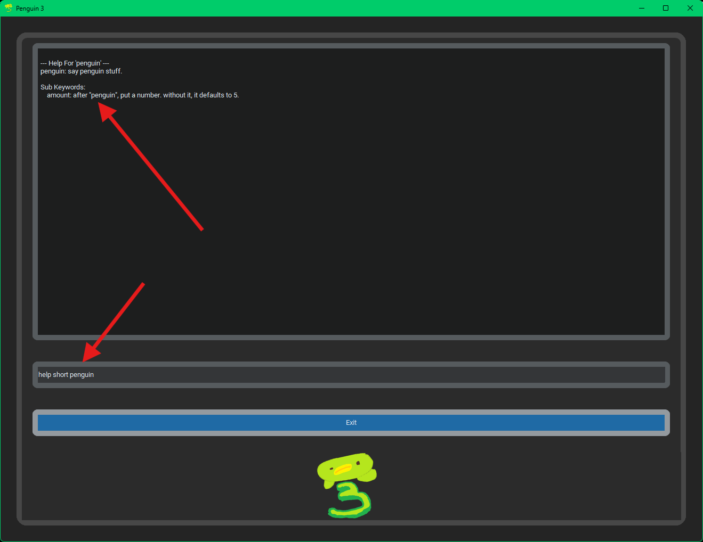

# Using help
Penguins sometimes need help.  

They can do it by [typing](typing_in_penguin_3.md) "help" and pressing enter.

## Navigating help
By default, `help` shows everything.

Keywords are what you type into the box.  
The meanings are provided by the game.  
Sub-keywords are what you put after the keyword.  
There are other knowledge to know about.  
You can also read on how to use sub-keywords.

### Long and short

You can see the short help like this: `help short`. It is like this by default.  
You can also see the long version: `help long`. This shows more information.

### Specific sections
You can see help for specific sections.  
For example, typing `help short penguin`. This gives short help on the command `penguin`.  
Or, you can do `help short other`. This shows help for the section `Other`.

